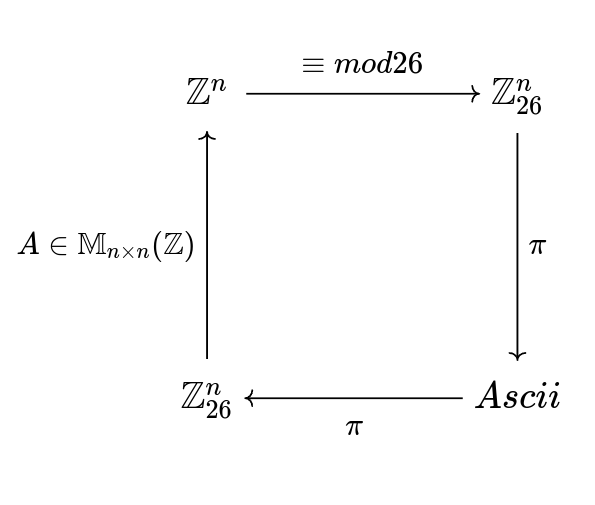

# BlockEncryption

A java implementation of the block encription algorithm for lager files using parallel computing.

### Mathematical model 

To make the encryption we create batches of (n) characters so we can create a vector $B \in \mathbb{Z}_{26}^n$

We can apply then a linear transform $A \in \mathbb{M}_{n \times n}(\mathbb{Z}_{26})$. This matrix will be created using a 
linear congruential generator whose seed would be the hash of the user password so we can recreate the matrix. 

The matrix $A$ must not be $mod(|A|) \equiv  0 mod 26$ so we guarantee the information won't colapse, and the inverse exists which will be used for the decryption algoritm.

In general the algoritm follows the next diagram.

### Parallel computing model 

### Executing the program

In order to execute the () for the server we need to give 
execution permissions to de file with the next commando

> chmod +x /maven/bin/mvn

then we compile the server files

> ./maven/bin/mvn

