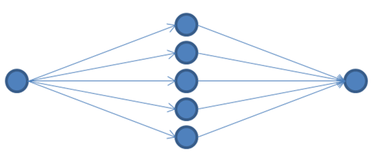
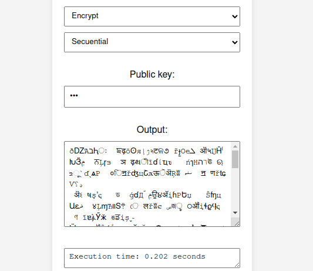
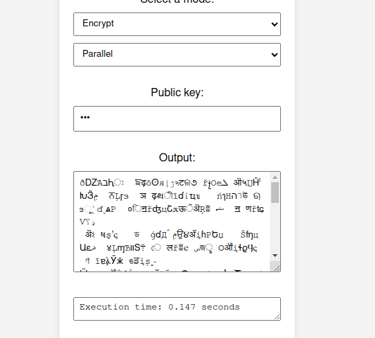

A java implementation of the block encryption algorithm for large files using parallel computing.


---------
---------
---------
---------


### Mathematical model 

Let $k \in  \mathbb{Z}$ be the number of valid charachteres in the language we are going to encrypt. And $n \in  \mathbb{Z}$, to make the encryption we create batches of n characters and turn it into a vector $B \in \mathbb{Z}_{k}^n$

We can then apply a linear map $A \in \mathbb{M}_{n \times n} (\mathbb{Z})$.
This matrix will be created using a linear congruential generator whose seed would be the hash of the user password so we can recreate the matrix.


The matrix $A$ must not be $mod(|A|) \equiv  (0)mod (k)$ so we guarantee the information won't collapse, and the inverse exists which will be used for the decryption algorithm.

In general the algorithm follows the next diagram.


For the matrix dimension, a small number [10, 30] should be better hence it wont produce larger entries in the resultant vecotor. By default the dimension is 10, then the matrix $A$ is of the form $A \in \mathbb{M}_{10 \times 10}(\mathbb{Z})$

The matrix will have tho form of a Lower matrix in order to simplify the search for the matrix. 

### Parallel computing model 

For the matrix product calculation, we have created a thread for every calculation until a maximum of $l \in \mathbb{Z}$ threads at the same time executing, where the number l will prevent overloading the system and get enough performance improvement, then batches of at most $l$ threads will be excuting. 

By default this number is 5 so the diagram ilustrates how the threads are called and then joined. 




The matrix multiplication can be parallelized as well, but in this case we chose not to, since the dimension of the matrices was chosen to be small. 

Another time consuming process is the creation of the matrix $A$, even though this process can not run in parallel because it uses backtracking to ensure the properties of the matrix. 


### The client-server model


For the server side, MARVEN and undertow. 

The messages are passed through a request with the parameters of key, mode and text, indicating the necessary parameters for the algorithm. 

The client-side was made with HTML, JavaScript and CSS. Is a simple form for the input text, whether the algorithm should encrypt or decrypt and a box with the output text. 

The queries for the server have the form 

> http://localhost:8080/?key=[publickey]&mode=[enctyption/decryption]&metod=[parallel/secuential]

The text is sent bia headers with the name of data so the headers mut have the next format 

```
{
    data:
        text
}
```

The characters will be encoded before sending it to the server and in the server will bi decoded. 

The server have a limitation of at most $100,000$ characters per header, but this can be changed in the server builder.

### Executing the program (ONLY FOR LINUX)

First we need to create the server-side, so we need first to compile the files.
In order to execute the compilation program for the server we need to give 
execution permissions to de file with the next command.

> chmod +x ./maven/bin/mvn

then we compile the server files.

> ./maven/bin/mvn

The commands to run the server are already in the runserver.sh file, which also need execution permissions

> chmod +x ./runserver.sh

then we can run the server just using

> ./runserver.sh

If we do not have any errors, we can go to or browser and type the next direction: 

> http://localhost:8080/

Where the algorithm should be running


### Advantages of parallel computing 

The point of parallelizing the algorithm is to improve the performance in terms of time complexity. Thahw why it is also posible to select the secuential version, in order to copare both versions. 

Here we are limited by the headers size but if we send the full size of headers, we on average save $30$% of time on average when the text is big enought. 

For a  small size  of thext the paraellel agorithm tend to be worse since it hace to create and stast the threads. 

Here an example of the algorithm encrypting the page of wikipedia about paralle programming using the full size of headers 

> Using secuential 



> Using parallel



Where we can se the $30$% of improvement
