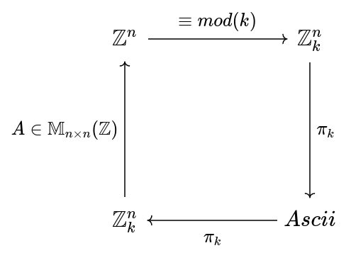

# BlockEncryption

A java implementation of the block encryption algorithm for large files using parallel computing.

### Mathematical model 

To make the encryption we create batches of (n) characters and a vector $B \in \mathbb{Z}_{26}^n$

We can then apply a linear map $A \in \mathbb{M}_{n \times n}(\mathbb{Z}_{26})$.
This matrix will be created using a linear congruential generator whose seed would be the hash of the user password so we can recreate the matrix.

The matrix $A$ must not be $mod(|A|) \equiv  0 mod (26)$ so we guarantee the information won't collapse, and the inverse exists which will be used for the decryption algorithm.

In general the algorithm follows the next diagram.

For the matrix dimension, a small number [10, 30] should be better hence it wont produce larger entries in the result vecotr. By default the dimension is 10, then the matrix $A$ is of the form $A \in \mathbb{M}_{10 \times 10}(\mathbb{Z}_{26})$

### Parallel computing model 

For the matrix product calculation, we have created a thread for every calculation until a maximum of 10 threads at the same time executing, so we prevent overloading the system and get enough performance improvement, then batches of at most 10 threads will be excuting. 

The matrix multiplication can be parallelized as well, but in this case we chose not to, since the dimension of the metrics was chosen to be small. 

Another time consuming process is the creation of the matrix $A$, even though this process can not run in parallel because it uses backtracking to ensure the properties of the matrix. 

### The client-server model

For the server side, MARVEN and undertow. 

The messages are passed through a request with the parameters of key, mode and text, indicating the necessary parameters for the algorithm. 

The client-side was made with HTML, JavaScript and CSS. Is a simple form for the input text, whether the algorithm should encrypt or decrypt and a box with the output text. 

### Executing the program (ONLY FOR LINUX)

First we need to create the server-side, so we need first to compile the files.
In order to execute the compilation program for the server we need to give 
execution permissions to de file with the next command.

> chmod +x ./maven/bin/mvn

then we compile the server files.

> ./maven/bin/mvn

The commands to run the server are already in the runserver.sh file, which also need execution permissions

> chmod +x ./runserver.sh

If we do not have any errors, we can go to or browser and type the next direction: 

> http://localhost:8080/

Where the algorithm should be running

